# Overview

This is a terminal implementation of a game I made called Mystic.
Mystic is a deck building, dungeon crawling rouge like where you cast spells to defeat enemies, travelling deeper and deeper into the dungeon.

This version of Mystic has 5 floors each harder than the last.

*Note: this version of Mystic is not being developed any more, a new version will eventually makes it way to Steam*

---

# Gameplay

The gameplay for this game is all done via commands typed into the terminal.

**Useful commands**

- Typing `?` into the terminal in almost all menus will show all commands accepted at that time
- Typing `!` will clear the terminal in case the prints get to big, for instance in combat

**Starting your first run**

cd to the directory with the csproj and type

```
dotnet run
```

This will build and run the application, make sure you have the dotnet runtime installed on your computer.

*Note: if you have Visual Studio installed, not VSCode, you most likely will already have the dotnet runtime installed*

The game will start by having you choose your character. Every character has a different starting deck and resources. You can view character stats by using the command `v <index>` where the index is the number next to the character.

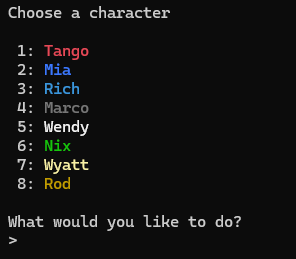

After choosing your character the game will place you onto the first floor of the dungeon.

*For tutorials sake I will choose Tango to start as him and Mia are the two easiest characters to play as*

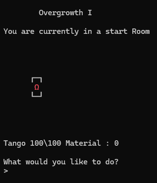

Your character is the omega symbol and you will see the walls of the room around you. In this case I can move left or right with `A` or `D` respectively.

From this screen you can edit your deck, view your inventory or look around the room you are in.

We'll have a quick peak at our inventory and our deck.

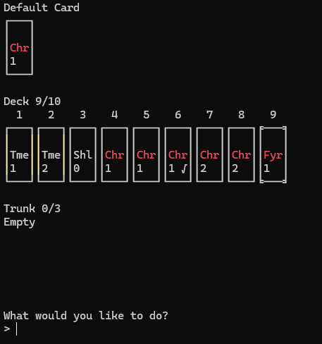

Looking at our deck there are three main sections.

**Default Card**

The default card is the card you will draw during a battle when your deck runs out. It's the spell Tango knows by heart.

**Deck**

These are the cards that you will be drawing from during a battle. If you notice the deck is limited, currently Tango has a maximum of 10 cards in his deck and 9 of the slots are filled.

**Trunk**

This is where cards that you want to keep or sell are stored. Trunk size is also limited so be careful.

Now taking a look at our inventory.

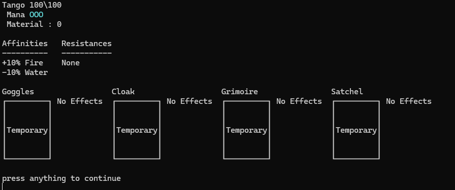

You can see that Tango has 100 out of 100 health, 3 mana containers, and no Material. Material is money, you can use it to purchase items at the shop or other things that we will cover later.

After that you can see the affinities and resistances that Tango currently has. Tango has an affinity for Fire magic and not an affinity for Water magic. This means that any spell that Tango casts belonging to those types it will apply the buff, or debuff.

The next section shows Tango's gear. This can be upgraded later in the game to provide additional effects making Tango stronger. Right now they have no effects.

Okay now we are ready to traverse the map.

Moving around you most likely will run into a battle.

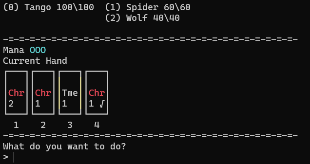

Hitting `?` we will see a whole host of commands

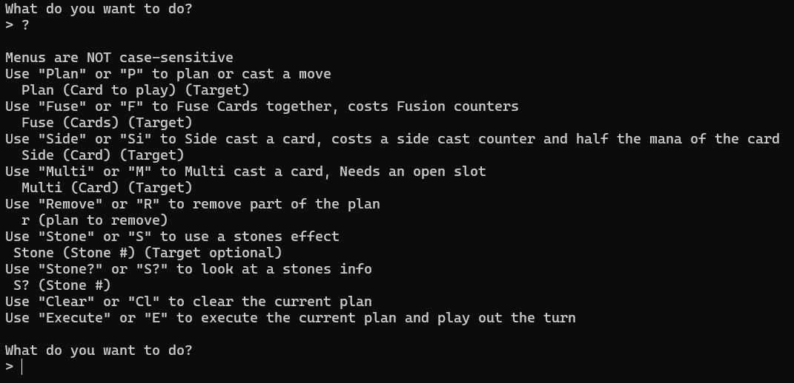

Some of these commands are not currently accessible and some will never be accessible during your run. Right now, the only commands we need are `p`, `e`, `r` and `clear`. These are all the short forms for the commands, they are much easier to type.

Using `p` will plan a card to be played, you will see it appear next to who you chose as the target.

*Note: if you do not specify a target it will default to the Caster, in this case, Tango*

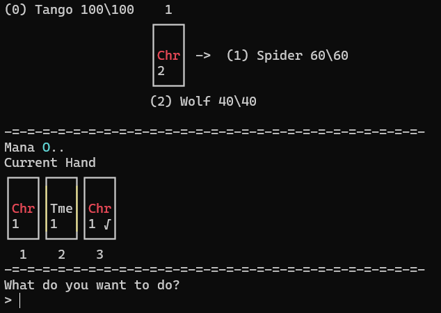

Okay we planned the Char 2 card on the spider and as you can see our mana was reduced by 2. This card costs two mana to play, that is what the 2 on the card means. It also represents how powerful the spell will be on cast.

Quick aside about planning cards. The cards with the yellow sections on their border, like that Time 1 card, are instant. This means they cannot be planned and their effects will take effect immediately.

Before we move on I will mention that some types of cards have different effects. Time cards, for instance, will allow the targeted character to draw as many cards as it costs. So for a Time 2 card the target will draw 2 cards.

Cards with green borders will heal instead of dealing damage, Shield cards will grant the target a shield that will block incoming damage, and Vision cards will allow for you to see the targeted characters plan for the turn.

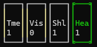

Okay back to the battle.

Your mana will refresh every turn so don't feel bad about using it up.
Let's look at our plan for the turn.

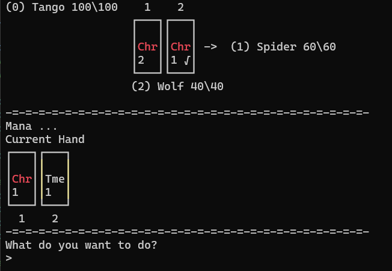

Notice that the Char 1 card I am playing has a symbol in the bottom right. This symbol is a modifier and will give the spell an extra effect. Here is a list of all the modifiers.

- `√` means Bounce. The spell will bounce and hit another character for half damage (could be the same one that it hit the first time)
- `Θ` means AOE. Will hit all characters on the targeted side.
- `Ω` means Summon. Instead of healing or dealing damage, a spell with this symbol will summon a creature to fight for you instead.

A symbol may also appear in the top right of the card. Here is a list of these symbols and their meanings.

- `ε` means Overload. This will make it so the caster has one less mana the turn after casting this spell.
- `+` means draw a card.
- `v` means thick. This means that when the deck is shuffled the card bearing this symbol will always appear in the bottom half of the deck.
- `^` means thin. A card bearing this symbol will always be shuffled into the top half of your deck.
- `S` means status. A card with this symbol will inflict some sort of status effect onto the target.

Okay, now that we have planned our turn, let's execute the plan.

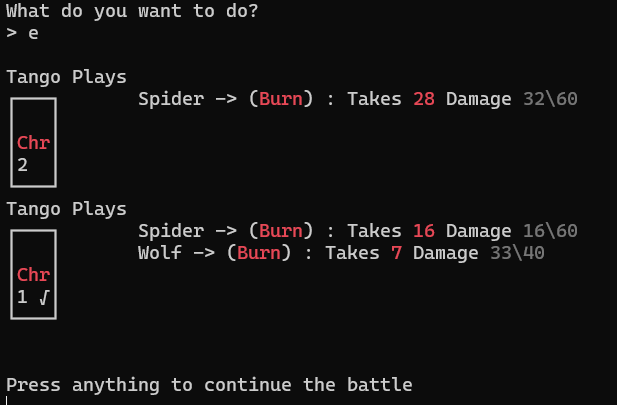

You can see the health totals of the enemies as the spells are cast. This is also where you would see enemy spells being cast, but in this case neither enemy decided to attack this turn.

On the next turn I decide to use the Time card in my hand, spending one mana and drawing an additional card this turn.

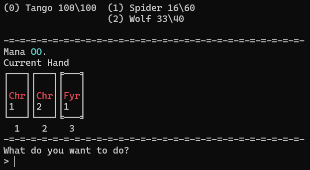

You can see that I drew a Fire card. This card is an upgraded spell from the Char cards we have been using so far. You can tell the tier of a spell by the border around it.

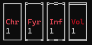

Since you have an understanding on how battles work, I will show you the next couple of turns without commenting.

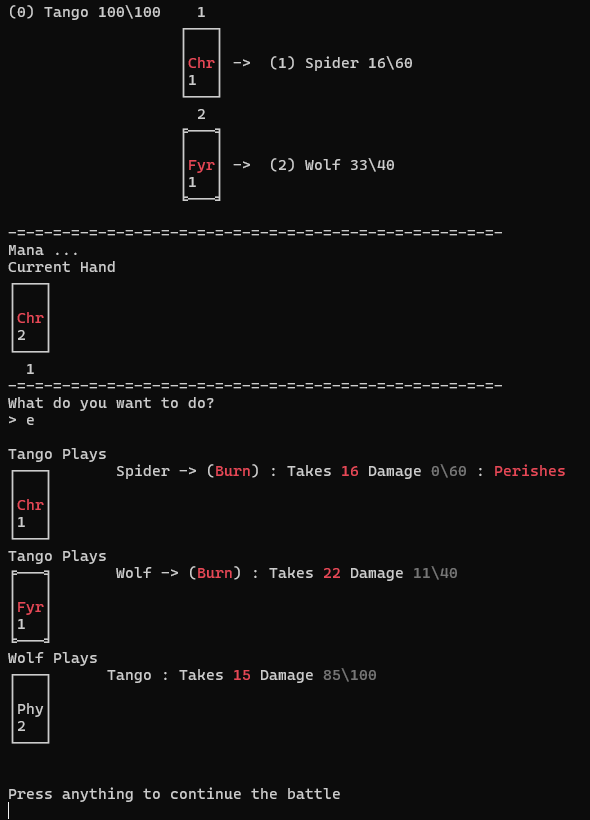

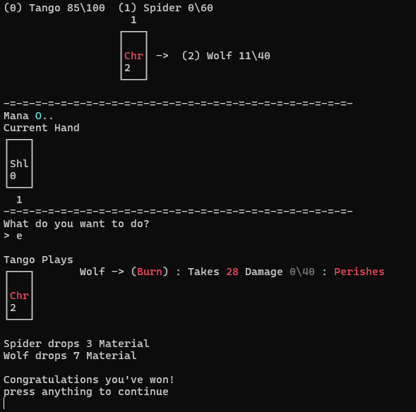

You can see that after defeating all enemies, the battle concludes and you are rewarded Material for your efforts.

*Note: you cannot run away from battles in this game*

Traversing the map, you will find a whole host of different rooms. You can interact with rooms using the command `q`.

While wandering around the floor you will eventually run into a boss room. The game will give you a warning before entering this room to give you a heads up.

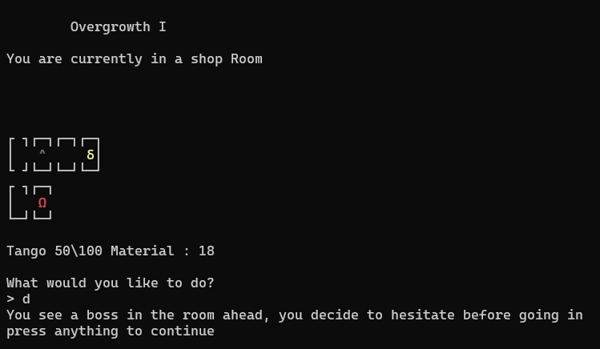

Fighting and defeating the boss on each floor is the objective of Mystic.

Once you defeat the Boss on the fifth floor, The Crystal Hollow, the run is over! you won!

*Note: in future versions of Mystic there will be a lot more floors to explore.*

There are several different types of rooms you can encounter on your journey. I will explain them here.

**Shops**

There are 3 different types of Shop in this version of Mystic.

- Pack shops, they sell packs you can buy to get better cards.
- Card shops, they sell individual cards to buff your deck.
- Tailors, they will upgrade your gear for a fee of Material.

**Campfires**

Each floor will have a campfire on it. This allows you to heal a random amount of health a limited number of times. Once the campfire is depleted the game will notify you and the symbol on the map will lose its colour.

**Inn**

The inn allows you to heal for the cost of Material. Handy for healing if all the campfires have gone out and you still need more health.

**The Cauldron**

The cauldron is a very powerful room that allows you to fuse cards together. Combining cards of the same type will often give an upgraded version of that type. This is a spot for you to mess around. Be careful if the cauldron is red however because finishing an unstable brew could be the end of you.

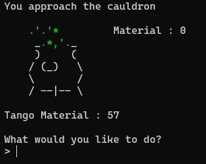

The cauldron does have limited uses and may eat your cards if you are not careful.

*Note: if you finish a brew with no cards you will be given whatever the previous user of the cauldron was brewing*

**The Altar**

The altar allows you to offer up spells to have a chance at obtaining rewards. The higher the value of what you offer, usually the better the reward you receive.

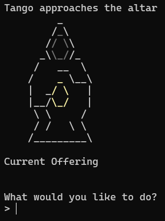

---

**Stones**

Next up, Stones. When you defeat a boss on a floor after the first one you will receive a Stone.

*Note: since the first boss does not grant the player a stone, they get a mana container instead*

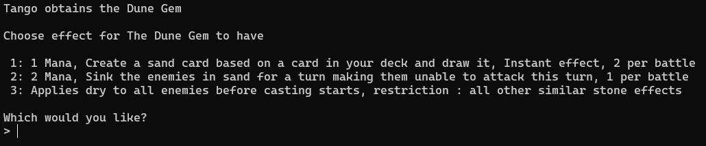

All of the stones that the bosses drop are unique and have effects that can be used in battle. Some effects are passive while others cost mana and have limited uses in a single battle.

---

**Reactions**

Lastly I want to mention reactions.
Reactions can happen when certain types are used one after the other.

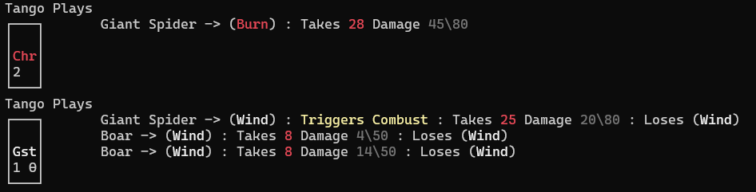

As you can see using a wind spell after a fire spell will cause Combust. This will make the spell deal extra damage on top of the regular damage. Be careful though, some reactions may be negative and reduce the amount of damage dealt.

*Note: some effects also remove themselves immediately after the spell is cast, for instance the `Wind` effect doesn't stick around after hitting the opponent*

---

# Final notes

If you play the game and have any thoughts I'd love to hear them, Feel free to post on the discussions part of the repo.
